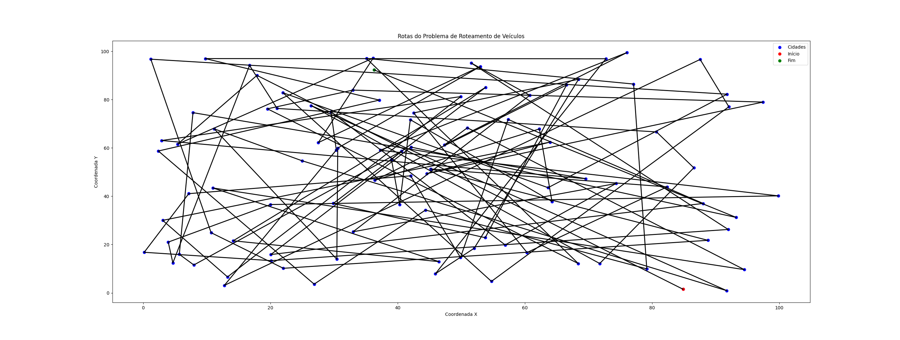
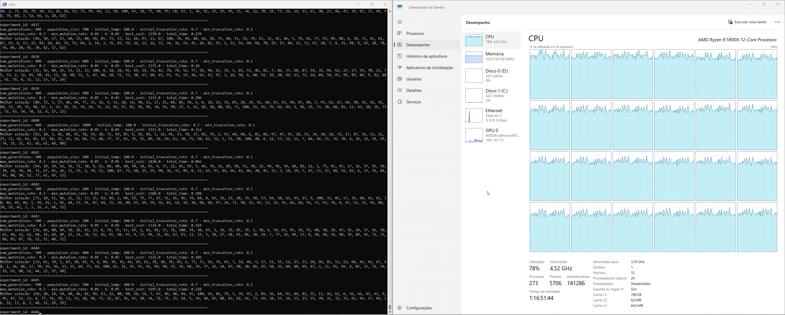

# Implementing an hybrid of genetic algorithm and simulated annealing for the vehicle routing problem in Julia

Este projeto teve como objetivo criar uma aplicação simples da meta-heurística algoritmo genético aplicado ao problema de roteamento de veiculos (VRP), utilizando a linguagem [Julia](https://julialang.org/). A linguagem Julia foi escolhida por ser uma linguagem de alta performance com velocidade comparada a da linguagem [C](https://julialang.org/benchmarks/).

 A solução é projetada para explorar eficientemente o espaço de busca através de um modelo adaptativo que ajusta parâmetros como taxa de mutação e taxa de truncamento durante a execução.

A Figura a seguir descreve uma solução factível para o problema representando qual deve ser a rota a ser realizada para minimizar a distância percorrida.

O algoritmo utilizado é uma variação do artigo original proposto por [Barrie M. Baker and M.A. Ayechew (2003)](https://doi.org/10.1016/S0305-0548(02)00051-5)

Também é possível encontrar mais explicações a respeito da meta-heurística genetic algorithm aqui: [2](https://en.wikipedia.org/wiki/Genetic_algorithm)

## Motivação:

Se você tem 100 cidades e precisa determinar a ordem de visita minimizando a distância (como em um Problema do Caixeiro Viajante - TSP), o número de possibilidades corresponde ao total de permutações das 100 cidades. Isso pode ser calculado como 100! (100 fatorial). Esse número é gigantesco. Para se ter uma ideia, ele é aproximadamente 9.33 × 10^157, ou seja, um número com 157 dígitos!

Comparações:
O número de átomos no universo observável é estimado em torno de 10^80, muito menor do que 100!. Mesmo os computadores mais rápidos do mundo levariam uma quantidade impraticável de tempo para avaliar todas essas possibilidades. 

Essa explosão combinatória é o motivo pelo qual heurísticas, meta-heurísticas (como algoritmos genéticos, simulated annealing, etc.), e algoritmos aproximados são usados para resolver problemas como o TSP em vez de tentar encontrar a solução exata.

## Visão Geral:
O algoritmo implementa as etapas clássicas de um algoritmo genético com adaptações dinâmicas para melhorar a performance:

- Inicialização da População: Uma população inicial é gerada de forma aleatória, representando soluções potenciais para o problema.

- Avaliação de Aptidão: Cada solução é avaliada com base em uma função de custo, que utiliza uma matriz de custos para calcular a qualidade da solução.

- Seleção: As melhores soluções são selecionadas com base em uma taxa de truncamento adaptativa.

- Crossover: Combinação de soluções "pais" para gerar "filhos" utilizando um ponto de corte aleatório.

- Mutação: Perturbação de soluções com base em uma taxa de mutação adaptativa.

- Iteração: O processo é repetido por um número específico de gerações, armazenando estatísticas para análise.

## Algoritmo Genético Principal

- A função genetic_algorithm é o coração do programa. Ela recebe como entrada:

- cost_matrix: Matriz de custos representando o problema a ser resolvido.

- num_generations: Número de gerações.

- population_size: Tamanho da população.

- initial_temp: Temperatura inicial para simulated annealing.

- initial_truncation_rate e min_truncation_rate: Parâmetros de seleção adaptativa.

- max_mutation_rate e min_mutation_rate: Taxas de mutação adaptativa.

- k: Parâmetro de ajuste da taxa de truncamento.

- show_iteration_results: Controla a exibição dos resultados intermediários.

## Grid Search

- A função grid_search_params executa uma busca em grade para otimizar os parâmetros do algoritmo. Ela:

- Varre combinações de parâmetros relevantes como temperaturas iniciais, taxas de mutação e tamanho da população.

- Armazena os resultados em um arquivo CSV para análise posterior.

## Parâmetros Configuráveis

- Os principais parâmetros que podem ser ajustados incluem:

- Dimensões da matriz de custo (número de navios e atividades).

- Intervalos de taxas de mutação e truncamento.

- Temperaturas iniciais para simulated annealing.

Número de gerações e tamanho da população.
## Testes realizados
Foram realizados 432 testes com os seguintes parâmetros:

    initial_temps = [100.0, 1000.0]
    ks = [0.01, 0.05, 0.1]
    min_mutation_rates = [0.01, 0.05, 0.1]
    max_mutation_rates = [0.3]
    min_truncation_rates = [0.1, 0.3]
    initial_truncation_rates = [0.7]
    num_generations = [100, 500, 1000, 5000]
    population_size = [100, 500, 1000]

Os testes foram realizados em um computador com as seguintes configurações:
- Linguagem Julia: 1.11 com Multithreading habilitado para 24 threads. 
- CPU: Ryzen 9 5900X
- MEM: 16GB DDR4

Os parâmetros utilizados e os resultados de cada teste são encontrados em results/geral_results_hybrid.csv

## Conclusões:
O algoritmo genético híbrido demonstrou ser uma abordagem eficiente para resolver problemas complexos de roteamento de veículos, explorando e explotando o espaço de busca com o auxílio de parâmetros adaptativos. 

Os resultados obtidos destacam o potencial dessa técnica, especialmente quando configurada corretamente para o problema em questão. Este projeto oferece uma base sólida para experimentações futuras, permitindo que melhorias adicionais sejam incorporadas com foco em desempenho e aplicabilidade em diferentes cenários.
